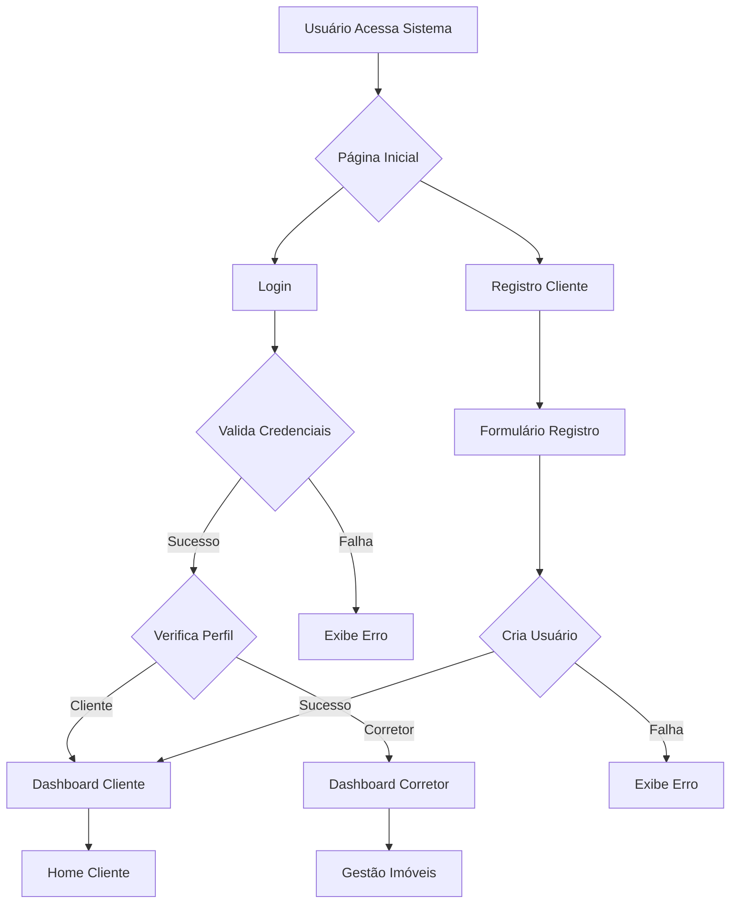
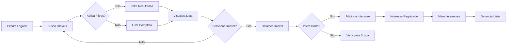
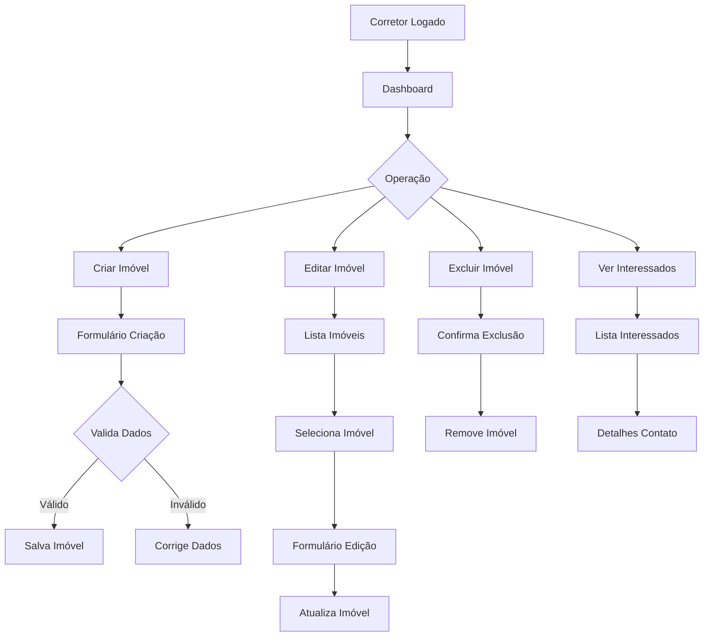
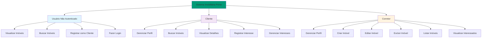
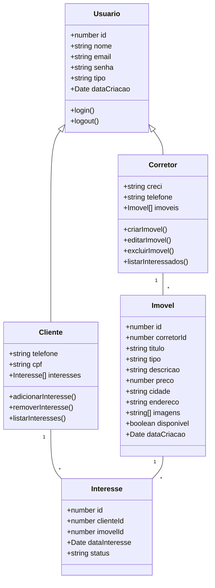

# 🏠 Imobiliária Prime - Plataforma Digital

## 📋 Sobre o Projeto
A Imobiliária Prime é uma plataforma web desenvolvida em Angular que conecta corretores a potenciais clientes, oferecendo um sistema completo de gestão imobiliária com autenticação segmentada por perfis.

## 🚀 Tecnologias Utilizadas
- **Frontend:** Angular 16+, TypeScript, SCSS, RxJS  
- **Backend:** JSON Server (API REST simulada)  
- **Autenticação:** Guardas de Rota Angular  
- **UI/UX:** Componentes Angular Material, Design Responsivo  

## 👥 Perfis de Usuário
### 🎯 Público Geral
- Visualizar imóveis em destaque  
- Buscar imóveis por filtros  
- Criar conta como cliente  

### 👤 Cliente
- Buscar e visualizar imóveis  
- Marcar imóveis como interesse  
- Gerenciar lista de interesses  
- Editar perfil pessoal  

### 🏢 Corretor
- Dashboard administrativo  
- CRUD completo de imóveis  
- Visualizar clientes interessados  
- Gerenciar anúncios próprios  

## 🔐 Diagramas de Fluxo

# 🚀 Tecnologias Utilizadas
- **Frontend:** Angular 16+, TypeScript, SCSS, RxJS  
- **Backend:** JSON Server (API REST simulada)  
- **Autenticação:** Guardas de Rota Angular  
- **UI/UX:** Componentes Angular Material, Design Responsivo  

## 👥 Perfis de Usuário
### 🎯 Público Geral
- Visualizar imóveis em destaque  
- Buscar imóveis por filtros  
- Criar conta como cliente  

### 👤 Cliente
- Buscar e visualizar imóveis  
- Marcar imóveis como interesse  
- Gerenciar lista de interesses  
- Editar perfil pessoal  

### 🏢 Corretor
- Dashboard administrativo  
- CRUD completo de imóveis  
- Visualizar clientes interessados  
- Gerenciar anúncios próprios  

## 🔐 Diagramas e Fluxos

### Fluxo de Autenticação e Redirecionamento

### Fluxo do Cliente - Busca e Interesse

### Fluxo do Corretor - Gestão de Imóveis

### 📊Diagrama de Casos de Uso

### Diagrama de Classes

